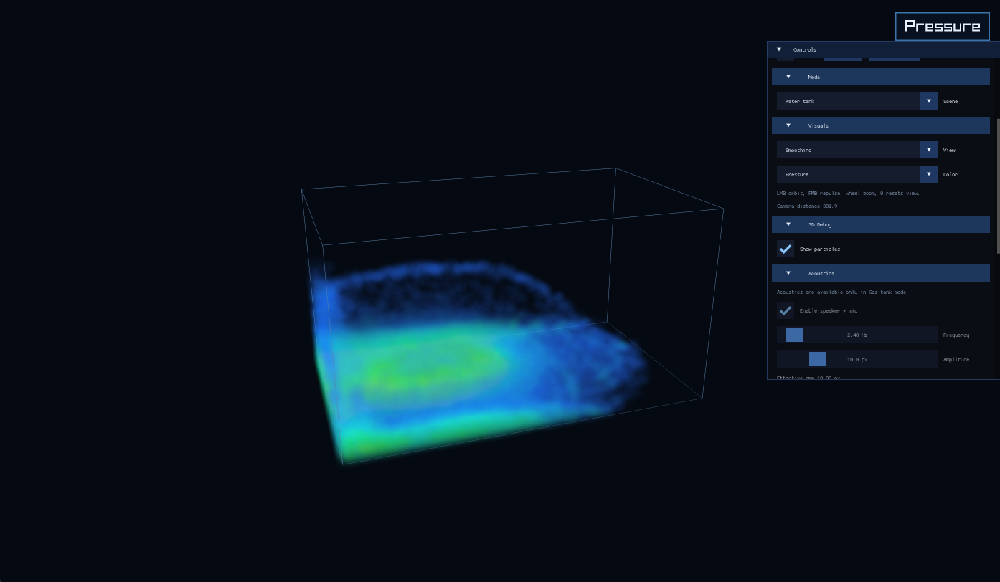
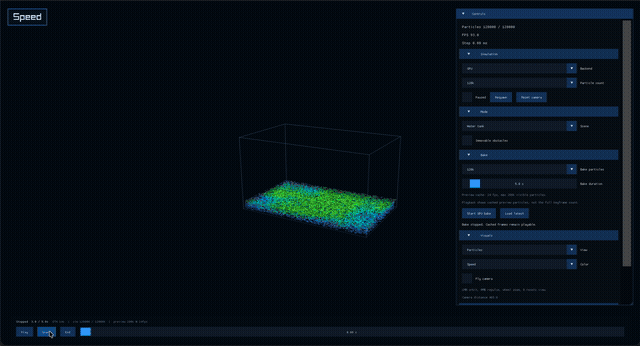
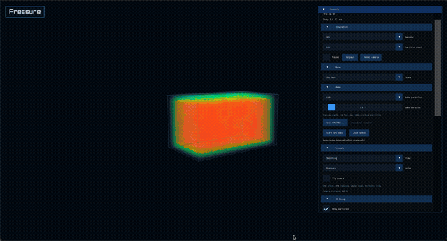
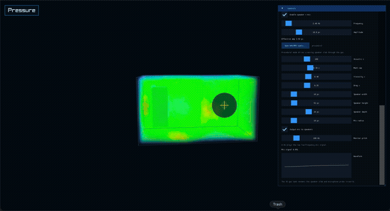
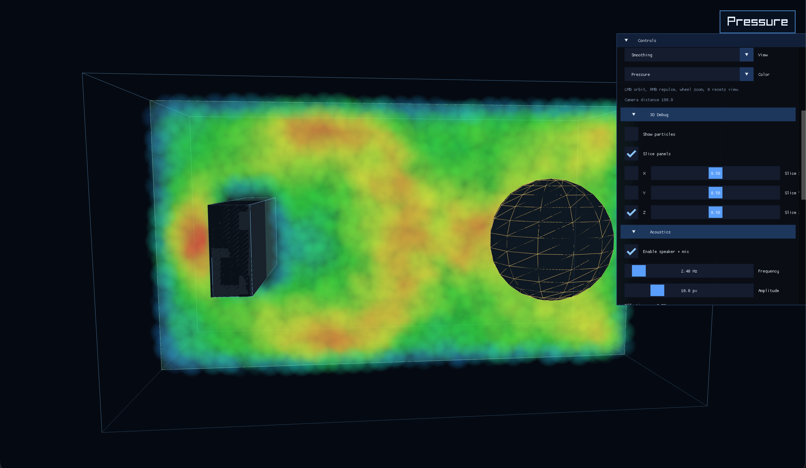
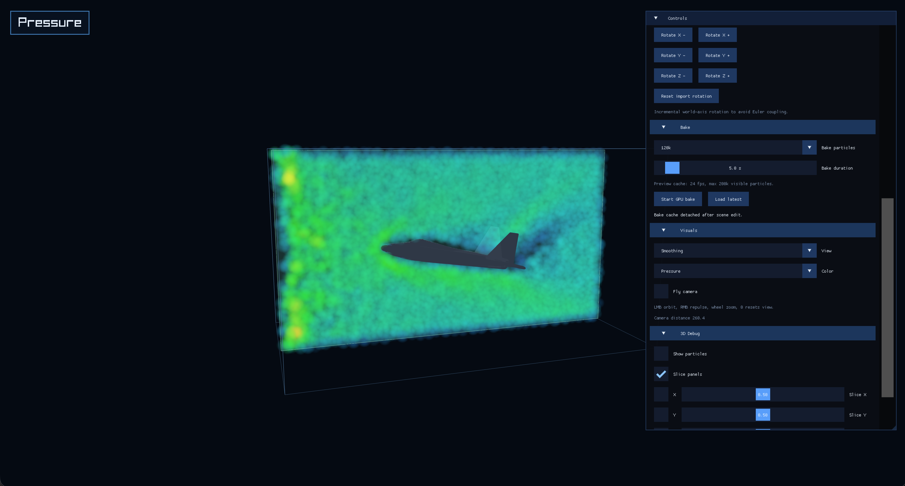
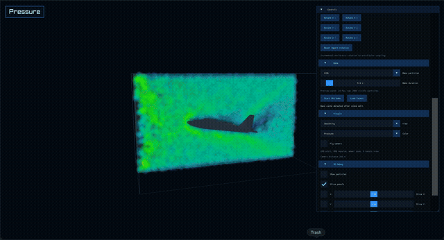
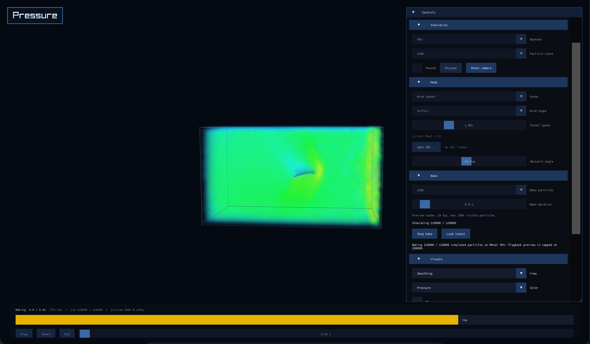

# FluidSim 3D

FluidSim 3D is a macOS Raylib + Metal particle simulator with water tank, gas tank, wind tunnel, imported OBJ obstacles, offline bake mode, and acoustics controls. Bake mode pre-computes simulations at up to 1M particles for smooth cached playback. Audio-driven bakes load MP3/WAV files, drive gas simulation with the audio signal, and export simulated microphone recordings as WAV.

## Preview

### Water mode





### Gas mode







### Wind tunnel mode







## How It Works

The app runs a 3D SPH solver with a uniform grid for neighbor search and CPU or Metal GPU simulation backends for density, force, and integration passes. Rendering uses GPU-instanced billboards for particles with a fallback path, plus slices, streamlines, pathlines, tank geometry, and imported OBJ previews driven by the same simulation state. Imported models collide through a voxelized signed-distance field.

Offline bake mode pre-computes frames at higher particle counts, caching them for smooth playback. Audio-driven bakes load MP3/WAV files, apply a slow-motion audio driver with bandwidth estimation and slowdown controls, and export simulated microphone pressure timelines compressed back to source-audio duration.

## Build

```bash
make
```

## Run

```bash
make run
```
