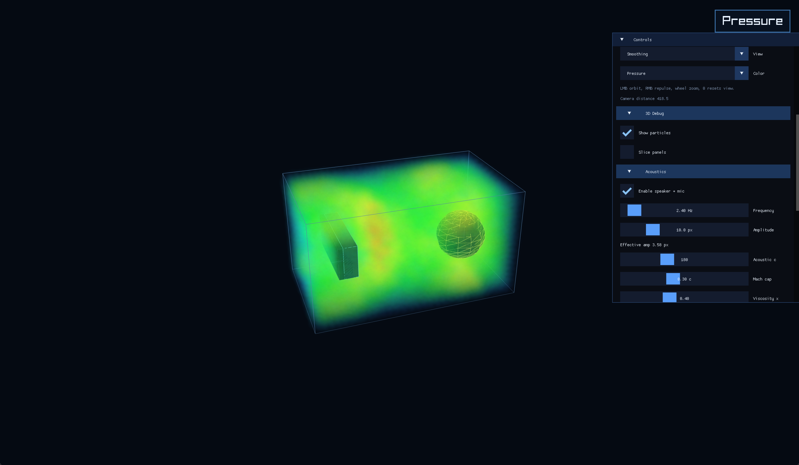
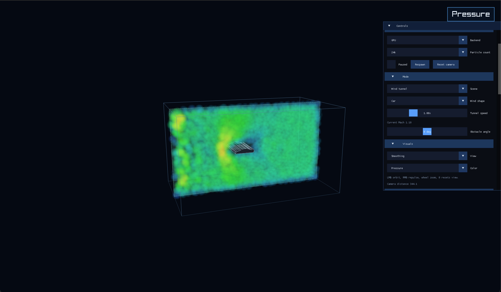
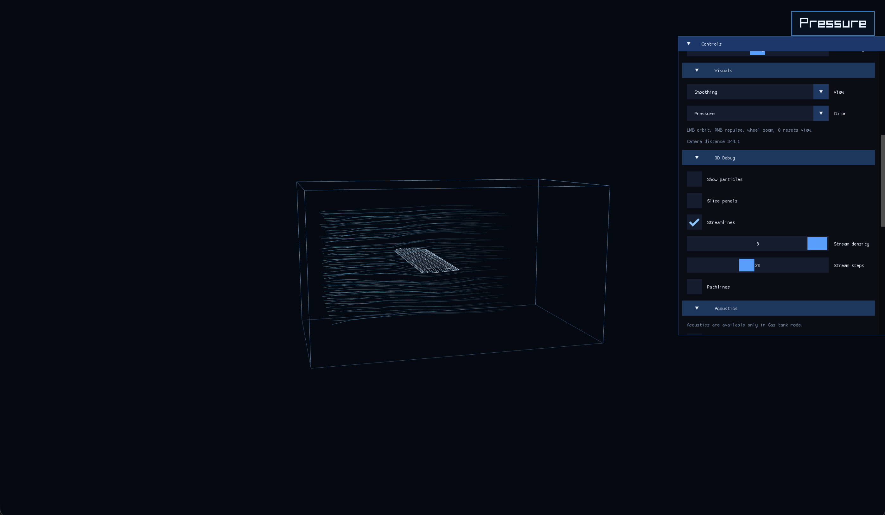
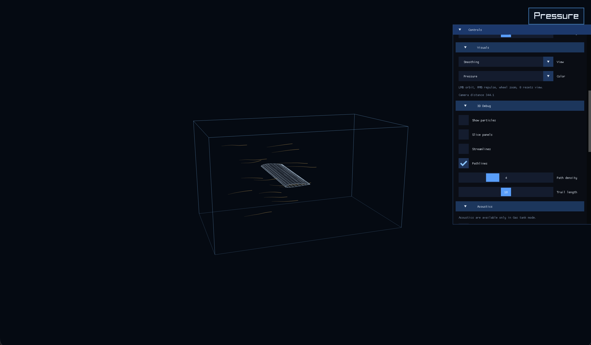
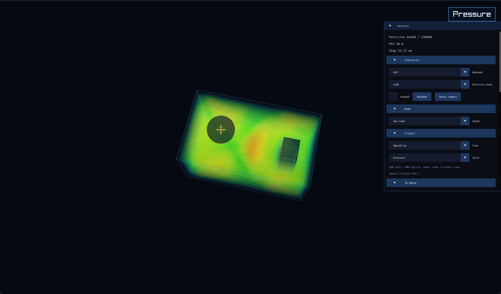
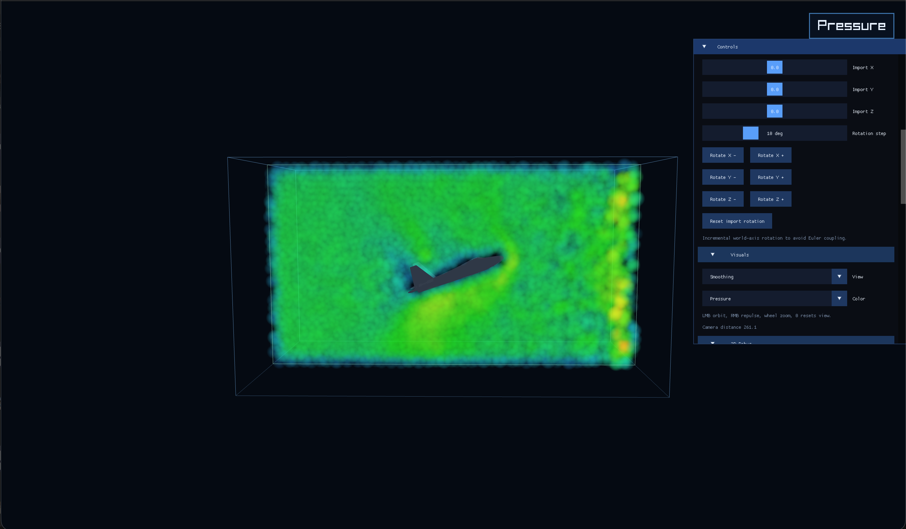

# FluidSim 3D

FluidSim 3D is a macOS Raylib + Metal particle simulator with water tank, gas tank, wind tunnel, imported OBJ obstacles and acoustics controls.

## Preview

### Water tank


### Gas tank


### Wind tunnel


### Streamlines


### Pathlines


### Pressure view


### Imported model


### Acoustics / mic


## How It Works

The app runs a 3D SPH solver with a uniform grid for neighbor search and CPU or Metal GPU simulation backends for density, force, and integration passes. Rendering stays in Raylib, with particles, slices, streamlines, pathlines, tank geometry, and imported OBJ previews driven by the same simulation state, while imported models collide through a voxelized signed-distance field.

## Build

```bash
make
```

## Run

```bash
make run
```
